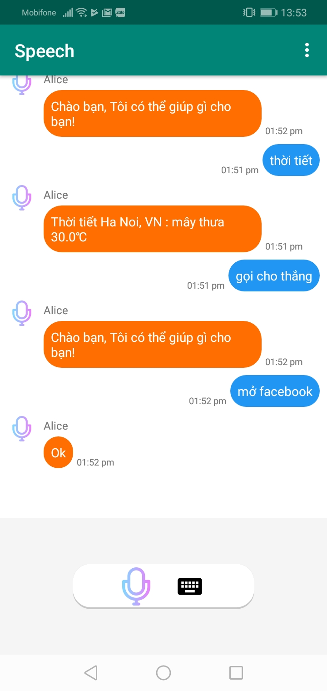
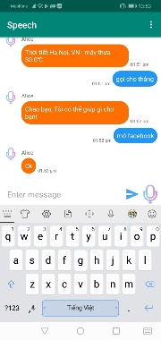
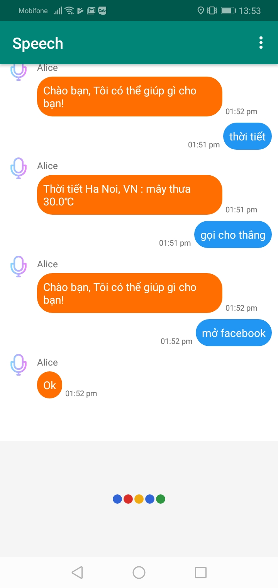
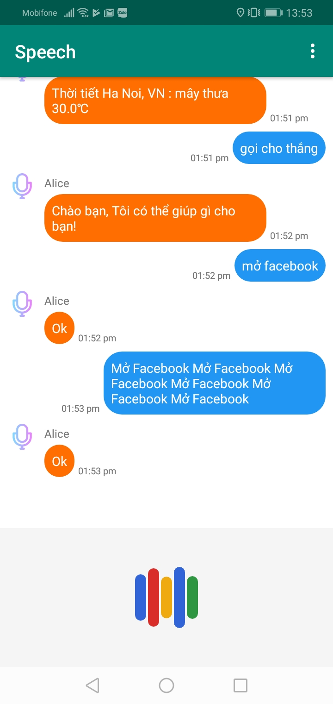

# Speech Processing in Android 

Application Android Assistant use API Speech to Text Google


## Wake-up(hotword)

Làm thế nào để mở ứng dụng trên Android bằng giọng nói giống như "Oke Goole" để mở Google Assistant. Trong ứng dụng Android đã được khởi chạy và đang ở chế độ chạy nền, ứng dụng chỉ chờ người dùng nói từ "hey okay"(từ hot word được cài đặt trước) thì ứng dụng sẽ chạy để bạn tiếp tục các trải nghiệm.

Chúng ta không thể nào xác định chính xác thời gian cần chờ đợi cho đến khi từ hot word được nói, có nghĩa là cách sử dụng nhận dạng giọng nói trực tuyến (vd: từ API Google) là không hợp lý. Hiện nay đã có PocketSphinx, một công cụ nhận dạng giọng nói có thể cài đặt trên các thiết bị di động hoạt động cục bộ trên điện thoại mà không cần kết nối Internet

Bạn có thể tham khảo thêm tại: [wolfpaulus](https://wolfpaulus.com/mac/custom-wakeup-words-for-an-android-app/) hoặc [github cmusphinx](https://github.com/cmusphinx/pocketsphinx-android-demo)

### Thêm hotword
Trong folder từ điển `src/main/assets/sync/models/lm` chứa tất cả các từ mà bạn muốn nhận ra. Một bảng băm MD5 được tạo và lưu trữ, bảng băm MD5 này cần được cập nhật mỗi khi bạn thay đổi bộ từ điển hotwords(Vd: sử dụng http://passwordsgenerator.net/md5-hash-generator/)

Đây là bộ từ điển để nhận ra các từ {hey, okay, john, george, paul, ringo, stop}

```
george  JH AO R JH
hey HH EY
john    JH AA N
okay	OW K EY
paul P AO L
ringo   R IY NG G OW
stop	S T AA P
```

Bạn có thể tạo ra cách phát âm cho từng từ trong từ điển bằng cách sử dụng **g2p-seq2seq**, nó sử dụng mô hình biến áp từ bộ công cụ tenor2tensor Một mô hình LSTM 2 lớp tiếng Anh với 512 đơn vị ẩn có sẵn trên trang web. Bạn có thể tham khảo hướng dẫn [tại đây.](https://cmusphinx.github.io/wiki/tutorialdict/#using-g2p-seq2seq-to-extend-the-dictionary)
## Screen 





## Hướng dẫn sử dụng

Đặt báo thức

* Đặt báo thức lúc {giờ cần đặt báo thức}

Điếm ngược

* Đặt đếm ngược {thời gian cần đếm ngược}

Gọi điện thoại

* Gọi số {số điện thoại}
* Gọi cho {tên trong danh bạ}
* Gọi cho taxi (mặc định gọi taxi G7 sdt: 024 3232 3232)

Google map

* Tìm đường đến {địa điểm}
* Tìm {địa điểm} gần nhất

Mở ứng dụng trên điện thoại 

* Mở {tên app}: chụp ảnh, Facebook, Youtube, Nghe nhạc(MP3), Messenger, Instagram, Google Map (tên tất cả các app có trên điện thoại)

Weather: chỉ show thời tiết vị trí hiện tại
    
* Thời tiết hôm nay thế nào?

Tìm kiếm bằng Google search:
* Hôm nay có sự kiện gì?
* Bà Tân Vlog là ai?

